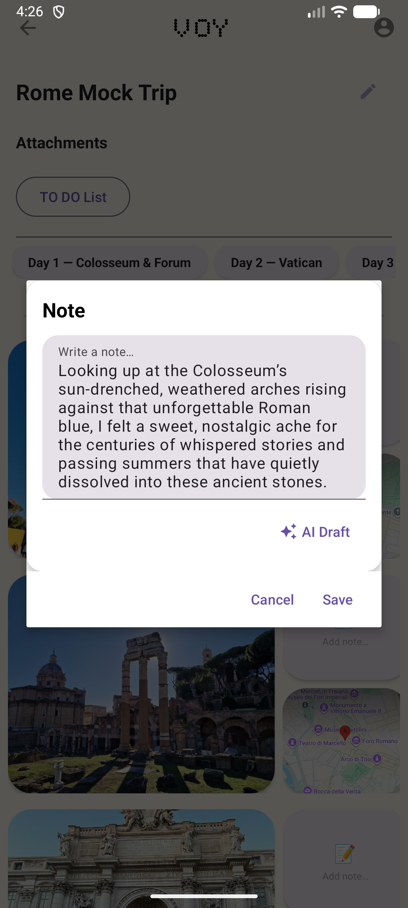

# VOY

VOY is an Android trip-tracking app that automatically documents your travels. While active, it runs a foreground service that captures the photos and videos you take, tags each one with the location it was taken at, and organizes everything into a day-by-day trip journal — complete with notes, maps, and AI-assisted features.

## Features

### Trip Tracking (Live Tracker)
- Runs as a **foreground service** that monitors and captures multimedia items (photos/videos) taken during the trip.
- Automatically fetches and attaches the **location** of each captured item.
- Groups captured media by day, displayed in a day-by-day timeline (Day 1, Day 2, Day 3, ...).

### Trip Journal
- Each trip has a dedicated page with:
   - Editable **trip title** and **notes**
   - **Attachments** section
   - Day-by-day tabs with photos, an inline map showing where each photo was taken, and a per-photo notes field
- **AI Draft** - generates a note/description for a photo using the Gemini API.
  

### Planned Vacations
- Alternative to live tracking: configure a trip in advance via **Configure Your Trip**:
   - Choose between **Live Tracker** and **Planned Vacation** modes
   - Set a **Destination City**
   - Select a **calendar date range** for the trip

### To Do List / Landmarks
- Add landmarks to visit, organized by day, with checkboxes that get automatically checked off based on the location of the media items.
- **Auto-Fill with AI** - uses the Gemini API to generate a suggested landmark/itinerary list based on the trip's destination, only for planned vacations.
  

### Mock Trip
- A sample **Mock Trip** (e.g. "Rome Mock Trip") is included so users can preview how a completed trip journal looks - with sample photos, notes, and maps - without needing to travel first.

### Account
- Email/password **Log In** and **Sign Up**
- Account **Info** and **Log Out** from the trip list menu

## Permissions

VOY requests the following device permissions to function:

| Permission | Purpose |
|---|---|
| Photos & Videos | To detect and display multimedia captured during a trip |
| Music & Audio | To access audio/media on the device |
| Alarms & Reminders | Allows the app to schedule a trip for a future time |
| Location | To tag captured items with the location they were taken at |

## Tech Notes

- Trip media capture relies on a foreground service, so the relevant permissions must be granted for tracking to work correctly in the background.
- AI-powered features (note drafting, itinerary/landmark auto-fill) are powered by the **Gemini API** and are experimental - results are not guaranteed and may occasionally fail or return incomplete output.
- Gemini API status: currently disabled in Google Cloud Console for this project.

## Setup
- Clone the repo.
- Copy app/google-services.json.example to app/google-services.json and fill in your own Firebase project values (download the real file from Firebase Console → Project Settings → your app). This file is gitignored and must not be committed.
- Add your Gemini API key and Maps Static API key to local.properties
